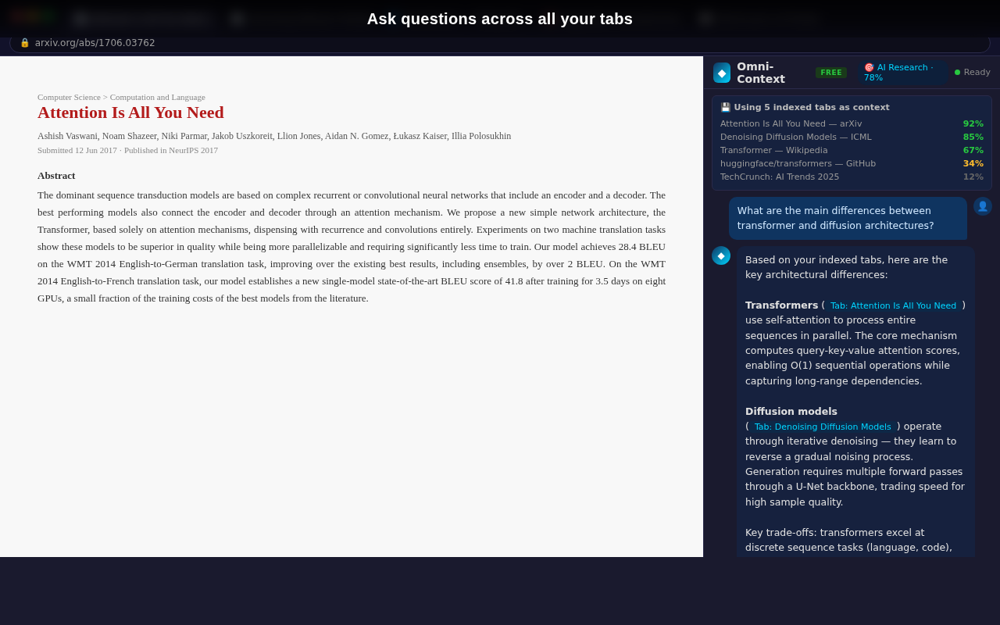
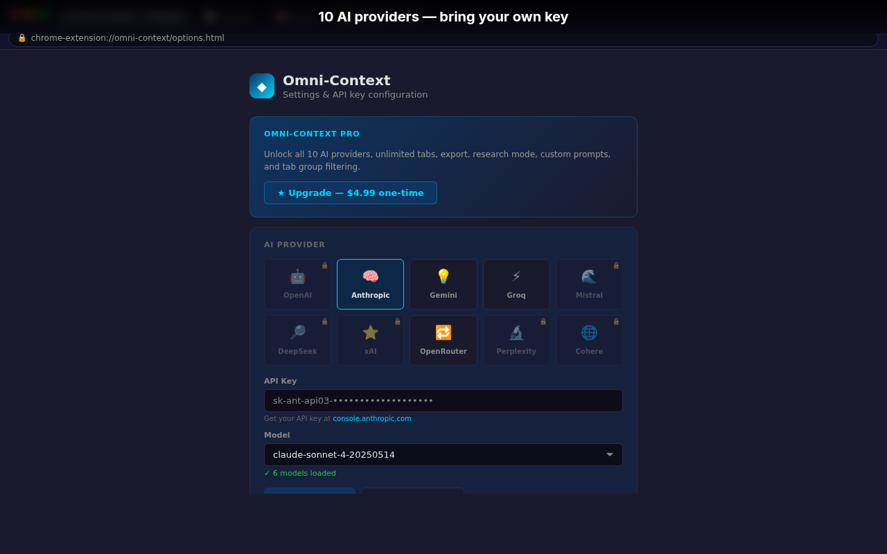
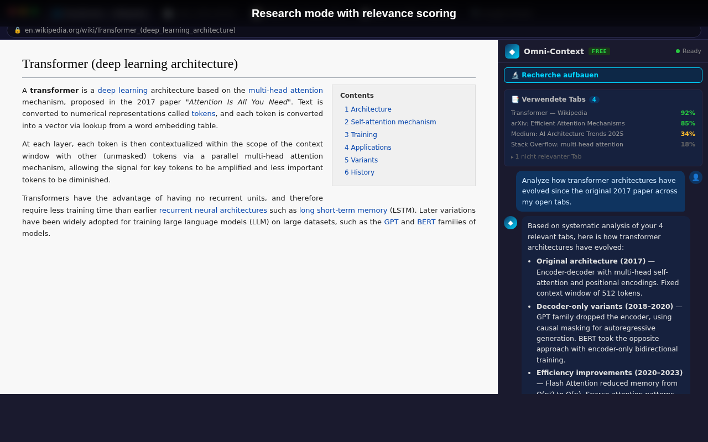
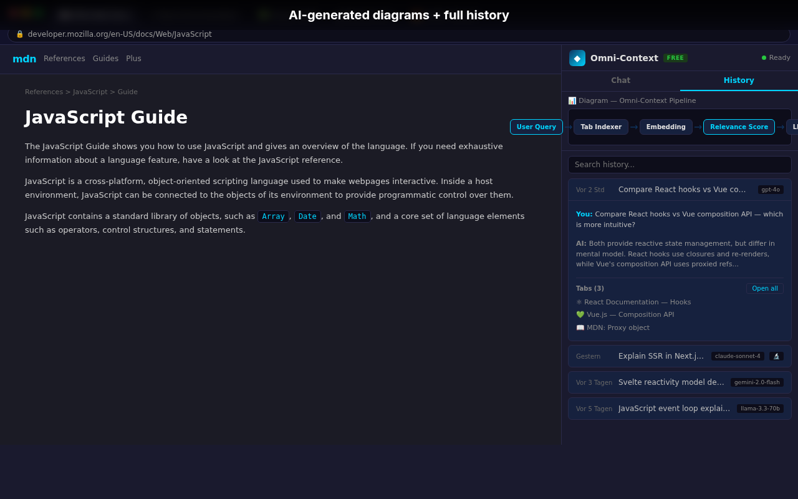
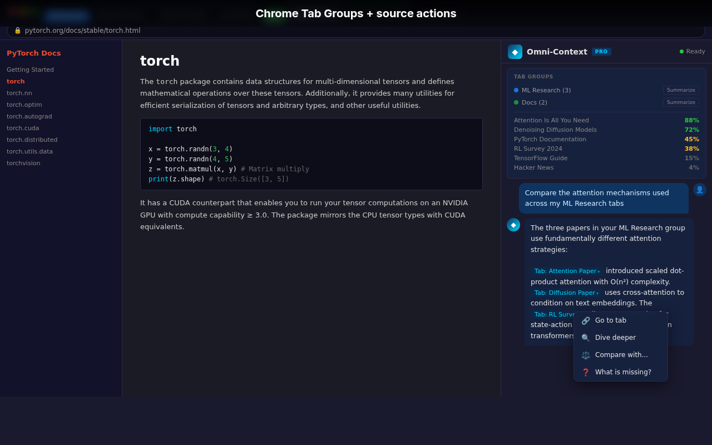

  

<h1 align="center">🧠 Omni-Context</h1>

  <strong>Chat with ALL your open browser tabs at once.</strong> 
  10 AI providers · BYOK (Bring Your Own Key) · 100% private — no backend, no data collection.

  <a href="#features">Features</a> •
  <a href="#screenshots">Screenshots</a> •
  <a href="#installation">Installation</a> •
  <a href="#supported-providers">Providers</a> •
  <a href="#privacy">Privacy</a> •
  <a href="#pricing">Pricing</a>

---

## ✨ What is Omni-Context?

Ever had 20+ tabs open and wished you could just *ask* them a question? Omni-Context indexes all your open browser tabs and lets you chat with their content using your favorite AI model — all from a sleek Chrome Side Panel.

**No backend. No accounts. No data leaves your browser.** Your API key stays in `chrome.storage` and requests go directly from your browser to the AI provider.

## Screenshots

  
   <em>Ask questions across all your tabs — AI answers with source citations</em>

  
   <em>10 AI providers — bring your own key, your key stays in your browser</em>

  
   <em>Research mode with systematic tab-by-tab analysis and relevance scoring</em>

  
   <em>AI-generated Mermaid diagrams rendered in chat + full conversation history</em>

  
   <em>Chrome Tab Groups integration + right-click sources to dive deeper</em>

## Features

🔍 **Smart Tab Indexing** — Automatically extracts and indexes content from all open tabs (including PDFs via PDF.js)

💬 **Side Panel Chat** — Persistent chat interface that stays open while you browse

🎯 **Relevance Scoring** — Jaccard similarity + keyword extraction ranks tabs by relevance to your query

📊 **Mermaid Diagrams** — AI can generate flowcharts, mindmaps, and diagrams rendered directly in chat

🔬 **Research Mode** — Systematic tab-by-tab analysis for deep research questions

📚 **Chat History** — Full conversation history with search, model badges, and tab context

🏷️ **Tab Groups** — Chrome Tab Groups integration with per-group summarization

🌐 **10 AI Providers** — OpenAI, Anthropic, Gemini, Groq, Mistral, DeepSeek, xAI, OpenRouter, Perplexity, Cohere

🔒 **100% Private** — BYOK, no backend, no analytics, no tracking. Zero data collection.

🇩🇪 **Multilingual** — Unicode-aware keyword extraction supports German, French, Spanish, and all languages

⚡ **Lightweight** — Vanilla JS, no build system, no dependencies. Fast and minimal.

## Installation

### From Chrome Web Store (Coming Soon)

🚧 Store listing in progress...

### Manual Installation (Developer Mode)

1. Download or clone this repo
2. Open Chrome → `chrome://extensions/`
3. Enable **Developer mode** (top right)
4. Click **Load unpacked** → select the `extension/` folder
5. Open the Side Panel (click the extension icon or use Chrome's Side Panel menu)
6. Go to Options → select your AI provider → enter your API key
7. Start chatting with your tabs! 🎉

## Supported Providers

| Provider | Models | Free Tier |
|----------|--------|-----------|
| OpenRouter | 100+ models | ✅ (free models available) |
| Groq | Llama, Mixtral | ✅ (generous free tier) |
| Google Gemini | Gemini Pro, Flash | ✅ (free tier) |
| OpenAI | GPT-4o, GPT-4, GPT-3.5 | ❌ |
| Anthropic | Claude Opus, Sonnet, Haiku | ❌ |
| Mistral | Mistral Large, Medium | ❌ |
| DeepSeek | DeepSeek V3, Coder | ❌ |
| xAI | Grok | ❌ |
| Perplexity | Sonar | ❌ |
| Cohere | Command R+ | ❌ |

## Privacy

**Omni-Context collects zero data.** Here's what happens:

- ✅ Your API key is stored locally in `chrome.storage.sync` — never transmitted anywhere except to your chosen AI provider
- ✅ Tab content is indexed in-memory and persisted to `chrome.storage.local` — never leaves your browser
- ✅ Chat requests go directly from your browser to the AI provider's API — no proxy, no middleware
- ❌ No backend server
- ❌ No analytics or telemetry
- ❌ No user accounts
- ❌ No cookies or tracking

[Full Privacy Policy](store/privacy-policy.md)

## Pricing

### Free
- 3 providers (OpenRouter, Groq, Gemini)
- Up to 10 indexed tabs
- Basic chat functionality

### Pro — $3.99/month or $29/year
- 7-day Pro trial
- All 10 AI providers
- More tabs for real work sessions
- Research Mode for deep multi-tab analysis
- Chat history export as Markdown
- Custom system prompts and templates
- Tab group filtering
- Your API keys stay local (BYOK, no tracking backend)

## Tech Stack

- **Chrome Extension Manifest V3** — Side Panel API, Service Worker
- **Vanilla JavaScript** — zero build system, zero npm dependencies
- **PDF.js** — client-side PDF text extraction
- **Marked.js** — Markdown rendering
- **Highlight.js** — Code syntax highlighting
- **Mermaid.js** — Diagram rendering

## Contributing

Contributions welcome! Please open an issue first to discuss what you'd like to change.

## License

MIT © [Vizion](https://github.com/vizion-maru)
# test
